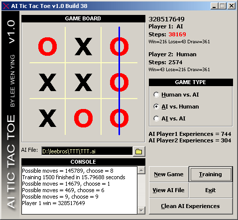



## AI Tic Tac Toe \(unbeatable true learning AI\)

### Description

An advanced version of "Tic Tac Toe that learns (True AI)" submitted by JengHowe which is further improved and optimized for a 'perfectly unbeatable' Artificial Intelligence in Tic Tac Toe games. It keeps a record (experience) of all the game that it has lost (both AI move first and move second) and determine the best possible move in order win or draw its opponent. The AI will learn from mistakes and get smarter until it is unbeatable!

Please vote for my work!
 
### More Info
 

             |
---                |---
**Submitted On**   |2004-03-04 18:42:36
**By**             |[Dennis Lee](https://github.com/Planet-Source-Code/PSCIndex/blob/master/ByAuthor/dennis-lee.md)
**Level**          |Intermediate
**User Rating**    |4.7 (52 globes from 11 users)
**Compatibility**  |VB 6\.0
**Category**       |[Games](https://github.com/Planet-Source-Code/PSCIndex/blob/master/ByCategory/games__1-38.md)
**World**          |[Visual Basic](https://github.com/Planet-Source-Code/PSCIndex/blob/master/ByWorld/visual-basic.md)
**Archive File**   |[AI\_Tic\_Tac171658352004\.zip](https://github.com/Planet-Source-Code/dennis-lee-ai-tic-tac-toe-unbeatable-true-learning-ai__1-52164/archive/master.zip)

